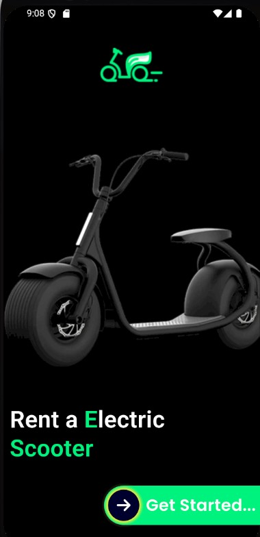
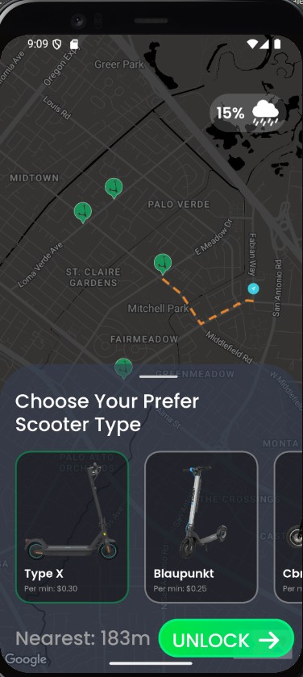
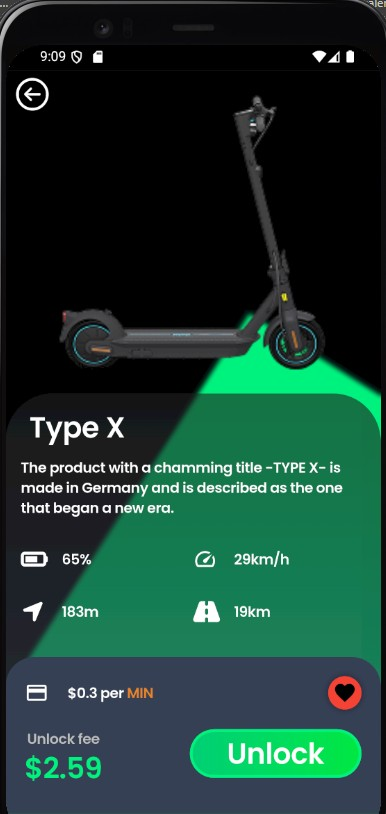

# 🛴 E-Scooter UI Clone (Flutter)

Bu proje, [Figma](https://www.figma.com/design/NzFOl2rhOCiHt6LMKkGrYa/E-scooter-App-UI--Community-?node-id=15-126&t=5yQaBzrA7csgzT4x-0) üzerinde yayınlanan modern bir e-scooter uygulama tasarımından ilham alınarak Flutter ile geliştirilmiştir. 

---

## 🚀 Özellikler

- 🗺️ **Google Maps entegrasyonu** (`google_maps_flutter`)
- 🛣️ **Rota çizimi** (`flutter_polyline_points`)
- 🌙 **Özel harita teması** (dark mode)
- 📍 **Özgün marker ikonları**
- 🖋️ **Özelleştirilmiş yazı tipi ve tema kullanımı**
- 📍 **Statik konum verileri** ile örnek harita senaryosu

---

## 🗺️ Harita Özellikleri

- **Harita Sağlayıcı:** Google Maps (SDK for Android)
- **API Servisi:** Directions API (rota çizimi)
- **Kütüphaneler:**
  - [`google_maps_flutter`](https://pub.dev/packages/google_maps_flutter)
  - [`flutter_polyline_points`](https://pub.dev/packages/flutter_polyline_points)
- **Harita teması:** `assets/map_style_dark.json` üzerinden özelleştirildi.

---

## 🎨 Tasarım Uyarlamaları

- Yazı tipi temaları Flutter'ın varsayılan `TextTheme` yapısına uymadığı için proje özelinde yeniden tanımlandı.
- Kullanılan fontlar:  
  - [Inter](https://fonts.google.com/specimen/Inter)  
  - [Poppins](https://fonts.google.com/specimen/Poppins)

---

## 📁 Gizlenen Dosyalar

Güvenlik nedeniyle aşağıdaki dosyalar `.gitignore` ile dışlandı ve paylaşılmadı:

- `lib/constant/app_constant.dart`  
  → Google API anahtarı içeriyor.
- `android/app/src/main/AndroidManifest.xml`  
  → Google Maps API anahtarı içeriyor.

---

## 🖼️ Ekran Görüntüleri

| Ana Ekran | Rota Gösterimi | Scooter Detayları |
|-------------------|--------------------|----------------|
|  |  |  |

---

## 📎 Kaynak Tasarım

Tasarım Figma üzerinden alınmıştır:  
🔗 [E-scooter App UI - Figma](https://www.figma.com/design/NzFOl2rhOCiHt6LMKkGrYa/E-scooter-App-UI--Community-?node-id=15-126&t=5yQaBzrA7csgzT4x-0)

---

